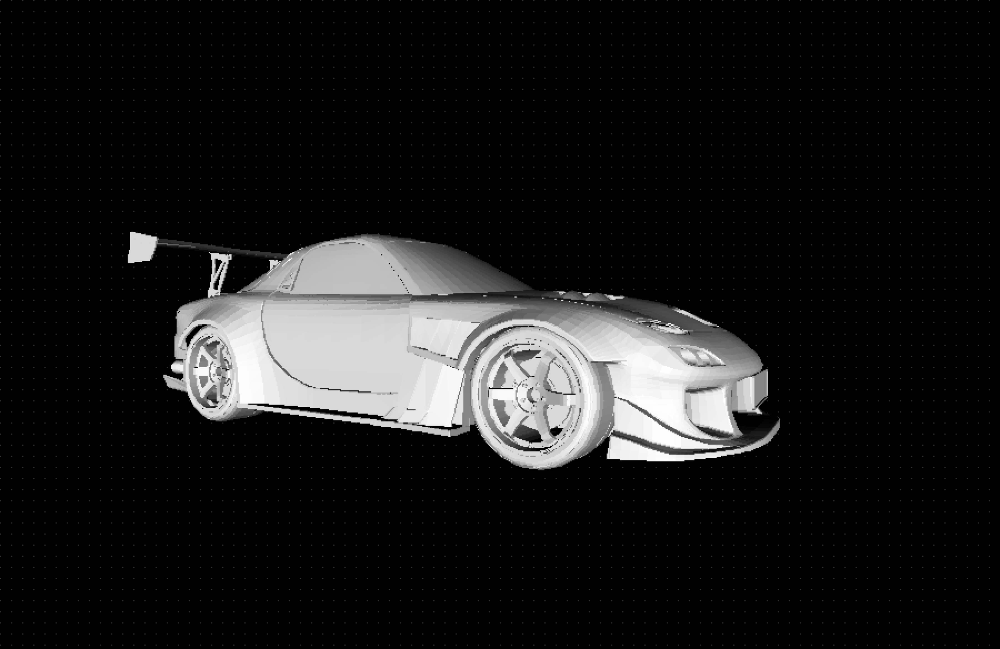
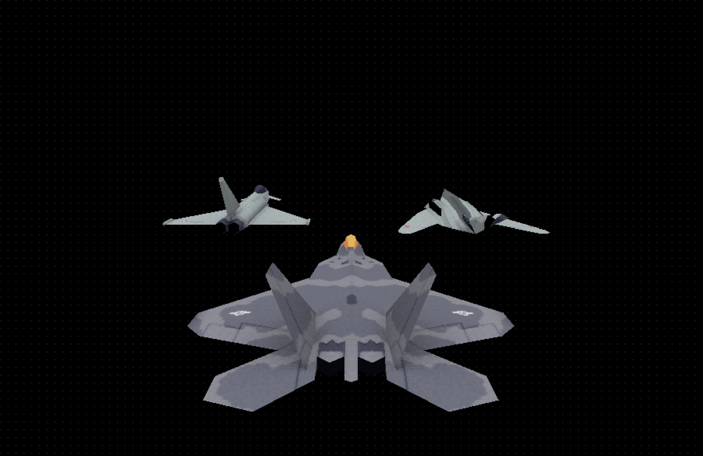

# ConanRenderer is a C-based Renderer using library SDL

## Using SDL for screen render window

## Overview:

ConanRenderer uses SDL for basic rendering pixels to the system.
It's my implementation for the 3D Rendering Course by Pikuma.

Had to deep-dive to understand the matrices and their implementation to transform the pixels/triangles/models to the desired way.
From pixel to Algo for Rendering trianglse -> to rendering full mesh

This renderer allows you to import your own .obj mesh and if there are textures, supported too in .png format.
Currently it only supports Base Color, no PBR rendering.
It can read UV Map data from the .obj

TODOs:
1. Support for .fbx and .gltf files
2. Support for .jpeg/jpg for texture support
3. Model Outliner (shows active mesh in scene)
4. Adding Gizmo and in-render mesh translation support.